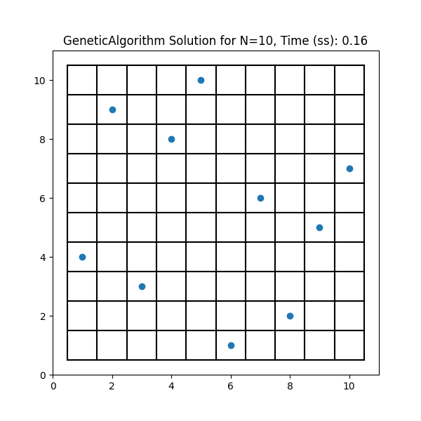

# n-queens solution with a genetic algorithm
 This repo implements the N Queen solution using a Genetic Algorithm and other global optimization algorithms.
 
 ## Motivation
 
[Crawford (1992)](https://dl.acm.org/doi/10.1145/130069.130128) describes two ways that GA can be used to solve the n-queens problem for large values of n.
1.	Simple heuristics for evaluating potential solutions:

 The problem with this approach is how to define a utility function to determine how good a solution is. One way to do this is by counting the number of diagonal conflicts.
 
2.	Evaluation based on satisfiability, DeJong and Spears (1989):
 
In the context of [NP](https://en.wikipedia.org/wiki/NP-completeness) problems, a criterion of satisfiability refers to a set of conditions that must be met in order for a solution to be considered valid or "satisfying." These conditions are often represented as a Boolean function that takes a proposed solution as input and returns either true or false, depending on whether the solution satisfies the conditions or not. In the N-Queens problem, the criterion of satisfiability is that no two queens can attack each other. So a valid solution would be a configuration of queens on an NxN chessboard where no two queens are in the same row, column, or diagonal. A proposed solution would be considered "satisfying" if it meets this condition. The contribution to the literature of Crawford is to show how the satisfiability criterion can be used for the N-Queens problem.

[Crawford (1992)](https://dl.acm.org/doi/10.1145/130069.130128) reports experiments using five different values of n (100, 150, 200, 500 and 1000). For this exercise, I have limited my experimentation up to n = 100.

 ## Task
 
 In this [notebook](https://github.com/manuzrpEd/NQueensGeneticAlgorithm/blob/main/notebooks/Implementation_NQueen_GeneticAlgorithm-Solution.ipynb) I have developed a Python solution that represents an implementation of Crawford's evaluation based on satisfiability. For example, running the mentioned notebook and entering N=10 we get the following result:
 
Solution:
[8, 2, 5, 1, 9, 4, 10, 7, 3, 6]

Time (ss): 0.11
 
 

