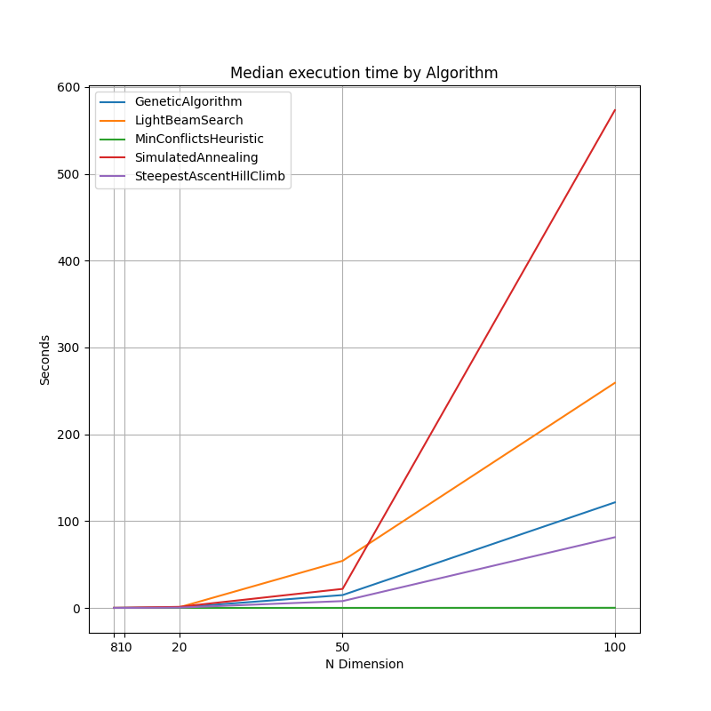

# N-Queens solution with a Genetic Algorithm
 This repo implements the N Queen solution using a Genetic Algorithm and other global optimization algorithms.
 
 ## Motivation
 
[Crawford (1992)](https://dl.acm.org/doi/10.1145/130069.130128) describes two ways that GA can be used to solve the n-queens problem for large values of n.
1.	Simple heuristics for evaluating potential solutions:

 The problem with this approach is how to define a utility function to determine how good a solution is. One way to do this is by counting the number of diagonal conflicts.
 
2.	Evaluation based on satisfiability, DeJong and Spears (1989):
 
In the context of [NP](https://en.wikipedia.org/wiki/NP-completeness) problems, a criterion of satisfiability refers to a set of conditions that must be met in order for a solution to be considered valid or "satisfying." These conditions are often represented as a Boolean function that takes a proposed solution as input and returns either true or false, depending on whether the solution satisfies the conditions or not. In the N-Queens problem, the criterion of satisfiability is that no two queens can attack each other. So a valid solution would be a configuration of queens on an NxN chessboard where no two queens are in the same row, column, or diagonal. A proposed solution would be considered "satisfying" if it meets this condition. The contribution to the literature of Crawford is to show how the satisfiability criterion can be used for the N-Queens problem.

[Crawford (1992)](https://dl.acm.org/doi/10.1145/130069.130128) reports experiments using five different values of n (100, 150, 200, 500 and 1000). For this exercise, I have limited my experimentation up to n = 100.

 ## Task - Implementation
 
 In this [notebook](https://github.com/manuzrpEd/NQueensGeneticAlgorithm/blob/main/notebooks/Implementation_NQueen_GeneticAlgorithm-Solution.ipynb) I have developed a Python solution that represents an implementation of Crawford's evaluation based on satisfiability. For example, running the mentioned notebook and entering N=10 we get the following result:
 
Solution:
[8, 2, 5, 1, 9, 4, 10, 7, 3, 6]

Time (ss): 0.11
 
 
 
Our implementation of Crawford's satisfiability criterion is fast as it is proportional to `O(n)`. We are able to reproduce the tests for different N-Queen values, up to n=100.

Median execution time in seconds for Genetic Algorithm and dimension N:

|   Dimension |   GeneticAlgorithm |
|------------:|-------------------:|
|           8 |          0.017515  |
|          10 |          0.0931005 |
|          20 |          0.323833  |
|          30 |          1.37552   |
|          50 |          8.01459   |
|          70 |         28.5628    |
|         100 |        113.254     |

Average execution time in seconds for Genetic Algorithm and dimension N:

|   Dimension |   GeneticAlgorithm |
|------------:|-------------------:|
|           8 |          0.0473736 |
|          10 |          0.0974075 |
|          20 |          0.344823  |
|          30 |          1.36329   |
|          50 |          9.23597   |
|          70 |         29.2303    |
|         100 |        113.844     |

To reproduce the above tests, see this [notebook](https://github.com/manuzrpEd/NQueensGeneticAlgorithm/blob/main/notebooks/Implementation_NQueen_GeneticAlgorithm-Times.ipynb).

 ## Task - Improvement
 
 In this section we provide the improvement that we have considered, which is that of providing a computational speed-up to reach the solution to the N-Queens problem. [Crawford (1992)](https://dl.acm.org/doi/10.1145/130069.130128) states that 'Future work in this area would include tests on other decision problems and comparisons with existing approximation techniques (on speed, convergence, % optimal, etc.)'. As such, we have chosen to perform a comparison with existing approximation techniques.
 
 ### Methods
 
 * [Light Beam Search](https://en.wikipedia.org/wiki/Beam_search)
 * [Minimum Conflicts Heuristic for solving constrained satisfaction problems (CSPs)](https://en.wikipedia.org/wiki/Min-conflicts_algorithm)
 * [Steepest Ascent Hill Climb](https://en.wikipedia.org/wiki/Hill_climbing)
 * [Simulated Annealing](https://en.wikipedia.org/wiki/Simulated_annealing)
 
 All four above methods have been extensively used for solving global optimization problems. I have applied the above four methods to the N-Queens problem and have evaluated their respective performance in terms of speed with respect to the genetic algorithm solution. Reproducing  the tests for different N-Queen values, we have the following results:
 
 
 
 To reproduce the above tests, see this [notebook](notebooks/Improvement_OptimizationAlgorithms.ipynb).
 
 As we can observe, Minimum Conflicts Heuristic is the best algorithm for our test cases. It is quite remarkable how efficient it is, outperforming all other methods at each test case. Also, it is worth to highlight that the Genetic Algorithm is the second best method in terms of speed.
 Nevertheless, these findings are of no surprise to the literature, since these optimization algorithms are widely popular and extensively studied. There are several research papers that have studied the application of the Minimum Conflicts Heuristic to the N-Queens problem. Some of them include:
 
    * "Solving the N-Queens Problem with the Min-Conflicts Heuristic" by Brian D. A. Rowley and David E. Culler (1991)
    * "Applying the Min-Conflicts Heuristic to the N-Queens Problem" by Mark T. Jones (1992)
    * "A Min-Conflicts Heuristic for the N-Queens Problem" by Daniel J. Karavanic and J. Michael Moore (1993)
    
These papers describe the implementation of the Minimum Conflicts Heuristic for solving the N-Queens problem and report on the results of the algorithm on various test cases. They also evaluate the performance of the algorithm and compare it with other methods. These papers do not provide a direct comparison between the Minimum Conflicts Heuristic and the Genetic Algorithm for solving the N-Queens problem specifically.

It's worth noting that the Minimum Conflicts Heuristic is a local search algorithm, so it does not guarantee to find the global optimal solutions. Yet, it is often good for problems with a large search space and can find a good solution in a reasonable amount of time. In particular, we implemented our code ensuring that we reached a solution in all the methods.

On the other side, the Genetic Algorithm is a global search method, meaning that it is searching the solution space with a probability based approach. Therefore, it is more likely to find the global optimal solution. However, the convergence rate to optimal solutions is generally slower than local search methods like Minimum Conflicts Heuristic.

In summary, while there isn't a direct comparison between Minimum Conflicts Heuristic and Genetic Algorithm for N-Queens problem in the literature, it is known that Genetic Algorithm is a global search method, while Minimum Conflicts Heuristic is a local search method, this fact can affect the performance of each algorithm on the N-Queens problem, and could be the reason why the Minimum Conflicts Heuristic is the best algorithm in terms of speed for our test cases.

 ## Coding Standards
 
 - We have tried to follow [PEP8](https://peps.python.org/pep-0008/) for Python whenever possible:

```
# Define Genetic Chess Class
class GeneticChess:
    """
    This class solves the N queen problem with a Genetic Algorithm solver.

    Attributes:
        n (int): The desired number of queens.
        p (int): The population size.
        printed_flag_shuffle (bool): A boolean to flag printing shuffle.
    """

    def __init__(self, n: int, p: int, printed_flag_shuffle: bool = False):
        """
        The constructor for the GeneticChess class.

        Parameters:
            n (int): The desired number of queens.
            p (int): The population size.
        """
        assert type(n) == int, "n is not an integer!"
        self.board = create_board(n)
        self.solutions = []
        self.size = n
        self.population_size = p
        self.env = []
        self.goal = None
        self.goalIndex = -1
        self.printed_flag_shuffle = printed_flag_shuffle
```

```
# entering the input from the command line
if not args.dimension:
    while True:
        dimension = input("Enter board dimension (the desired number of queens): ")
        try:
            dimension = int(dimension)
            if dimension < 4:
                print("Error: Dimension should be an integer n>=4, try again!")
            else:
                break
        except ValueError:
            print("ValueError: Dimension must be an integer n>=4, try again!")
else:
    dimension = args.dimension
```

The above two examples show that we have used appropriate spacing for indentation, limiting lines to a maximum number of characters, using meaningful variable and function names, explaining functions, appropriate use of Python data structures, error checking, exception handling etc. Adhering to PEP 8 can make the code more readable and consistent, and can help reduce the number of errors in the code.

 ## Reproducibility
 
 Run from the command line the following code to install all the dependencies of this repo:
 
```
python -m pip install --upgrade pip
pip install -r requirements.txt
```

### Requirements

* Python 3.9+

### Execution

* Run the program with the `help` flag to see available options:

```
python GeneticAlgorithm.py --help
```

* Run the program (and it will prompt you to input the number of dimensions):

```
python GeneticAlgorithm.py
python SteepestAscentHillClimb.py
python SimulatedAnnealing.py
python MinConflictsHeuristic.py
```

* Run the program with the arguments:

```
python GeneticAlgorithm.py -p 1000 -n 10
python SteepestAscentHillClimb.py -n 8
python SimulatedAnnealing.py -n 9
python MinConflictsHeuristic.py -n 12
```
